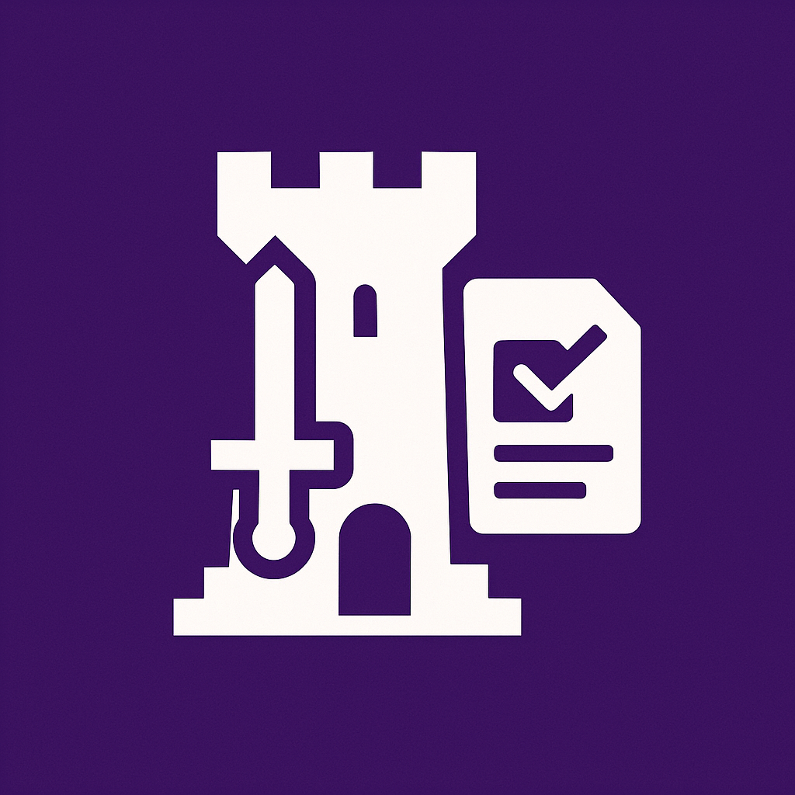

<h1 align="center">
  <a href="https://github.com">
    
  </a>
</h1>

<!--
<p align="center">
    <a href="http://134.199.168.173:5000/"> 🌍 Demo Deployment </a> <br>
</p>
-->

<p align="center">
    <i>Demo deployment was available during the course evaluation period. The deployment has been taken down after the assessment.</i>
</p>

# TaskMasters - Gamified Task Management System

A full-stack gamified task management system built with the MERN stack (MongoDB, Express.js, React, Node.js) that transforms everyday task management into an engaging game-like experience.

## Overview

TaskMasters combines traditional task management with gamification elements including:
- **Card System**: Blank cards and reward cards with cooldown mechanics
- **Character Development**: Experience points, levels, and stat allocation
- **Achievement System**: Track progress and unlock achievements
- **Dungeon Mode**: Combat system with monsters and reward cards
- **Inventory & Shop**: Collect and purchase equipment and items

This project was developed as part of the CS732 coursework at the University of Auckland, showcasing the ability to design and implement a gamified task management system.

## Features

### Core System Modules

#### Task Management System
- Create, edit, and delete tasks with subtask decomposition
- Daily tasks (maximum 3 per day) with equipment mechanics
- Task status tracking and completion rewards

#### Card System (Core Mechanism)
- **Task-Card Binding**: All tasks must be equipped with cards
- **Daily Draw System**: Limited draws per day with cooldown periods
- **Card Types**: Reward cards and blank (normal) cards
- **Strategic Element**: Cards affect task completion bonuses

#### Leveling & Experience System
- Experience accumulation through task completion
- Level-based rewards and unlock mechanisms
- Stat point allocation upon leveling up

#### Achievement System
- Automatic achievement unlocking based on user behavior
- Categorized achievements (hidden and visible)
- Achievement rewards and progression tracking

#### User Statistics Module
- Track task completion counts and streaks
- Record dungeon exploration progress
- Comprehensive statistics for achievement calculations

#### Shop & Economy System
- Purchase items, cards, and equipment with earned currency
- Character class and level-based item restrictions
- Dynamic inventory with seasonal items

#### Inventory & Equipment Management
- Manage collected items and equipment
- Item effects and character enhancement

#### Character Class System
- Choose from multiple character classes (Warrior, Mage, etc.)
- Class-specific equipment and abilities
- Initial stat distribution based on chosen class

#### Dungeon Exploration
- Daily dungeon challenges with increasing difficulty (infinite exploration in demo version)
- Progress tracking and reward systems
- Highest floor achievements and challenge history

#### User Account Management
- Secure registration and login with JWT authentication
- Profile customization and character setup
- Account settings and preferences

## System Architecture

### Core Modules Overview
Our system is built with 11 interconnected modules, each handling specific aspects of the gamified experience:

1. **Task Module** - Core task management and templates
2. **Level Module** - Experience and progression system  
3. **Achievement Module** - Goal tracking and rewards
4. **User Stats Module** - Comprehensive analytics
5. **Card Module** - Strategic card-based mechanics 
6. **Shop Module** - In-game economy and purchases
7. **Inventory Module** - Item and equipment management
8. **Character Module** - Class system and attributes
9. **Dungeon Module** - Adventure and challenge content
10. **User Module** - Authentication and account management
11. **Middleware & Services** - Cross-cutting concerns

### Key Design Principles
- **Modular Architecture**: Each module handles specific functionalities
- **Card-Task Integration**: The unique card system enhances traditional task management
- **Progressive Unlocking**: Features unlock as users advance through levels
- **Balanced Economy**: Multiple currency systems and reward mechanisms

## Quick Start

### Prerequisites
- Node.js 16+
- MongoDB 4.4+ or MongoDB Atlas
- npm

### Installation

1. **Clone the repository**
```bash
git clone git@github.com:UOA-CS732-S1-2025/group-project-taskmasters.git
cd group-project-taskmasters
```

2. **Install server dependencies**
```bash
cd ./server
npm install
```

3. **Install client dependencies**
```bash
cd ./client
npm install
```

4. **Environment setup**

Copy the provided `.env.example` files to `.env` in both server and client directories and fill in the required values.

**Note**: The actual environment variables are provided separately to avoid exposing sensitive information in the public repository. See `ENV_SETUP.md` for details.

5. **Start MongoDB**
Make sure MongoDB is running on your system.

6. **Run the application**

Start the backend server:
```bash
cd server
npm run dev
```

Start the frontend application:
```bash
cd client
npm start
```

The application will be available at `http://localhost:3000`

## Testing

### Frontend Tests
Run React component tests:
```bash
cd client
npm test
```

### Backend Tests
Run server-side tests with coverage:
```bash
cd server
npm test
npm run test:coverage
```

### Integration Tests
Run the full test suite:
```bash
# From the root directory
npm run test:all
```

## Project Structure

```
TaskMasters/
├── client/                 # React frontend
│   ├── public/            # Static assets and game icons
│   ├── src/
│   │   ├── components/    # Reusable React components
│   │   │   ├── task/      # Task-related components
│   │   │   ├── game/      # Game mechanics components
│   │   │   ├── achievement/ # Achievement system
│   │   │   └── ...
│   │   ├── pages/         # Page components
│   │   ├── context/       # React context providers
│   │   ├── services/      # API service functions
│   │   └── utils/         # Utility functions
│   └── package.json
├── server/                # Express.js backend
│   ├── controllers/       # 11 core module controllers
│   │   ├── taskController.js
│   │   ├── cardController.js     # Core Card System
│   │   ├── levelController.js
│   │   └── ...

│   ├── models/           # Mongoose schemas for each module
│   ├── routes/           # Module-based API routes
│   ├── middleware/       # Authentication & validation
│   ├── services/         # Cross-module business logic
│   ├── utils/            # Helper functions
│   └── __tests__/        # Comprehensive test suite
```

## How to Use

### Getting Started
1. **Create an Account**: Register and choose your character class
2. **Complete Tutorial**: Learn the card system and task mechanics
3. **Daily Routine**:
   - Draw your daily cards
   - Create and equip tasks in your 3 daily slots
   - Attach appropriate cards to tasks
   - Complete tasks to earn XP and rewards
4. **Level Up**: Allocate stat points and unlock new abilities
5. **Explore Dungeons**: Challenge floors for additional rewards
6. **Shop & Upgrade**: Purchase better cards and equipment
7. **Achievements**: Track your progress and unlock special rewards

### Pro Tips
- Strategic card management is key to maximizing rewards
- Different character classes excel with different task types
- Daily dungeon runs provide valuable resources
- Long-term tasks can be broken into manageable subtasks

## Technology Stack

### Frontend
- React 18
- React Router 6
- Tailwind CSS
- Framer Motion (animations)
- Axios (HTTP client)
- Socket.IO Client (real-time features)

### Backend
- Express.js
- MongoDB with Mongoose
- JWT Authentication
- Socket.IO (real-time communication)
- Node Cron (scheduled tasks)

### Backend Architecture
- **Modular Design**: 11 core modules with separated concerns
- **RESTful API**: Organized by feature modules
- **Middleware Layer**: Authentication, error handling, and request validation
- **Service Layer**: Business logic separation for achievements and statistics

### Testing
- Jest
- React Testing Library
- Supertest (API testing)

## Team Members

- Feihao Shi (fshi538@aucklanduni.ac.nz)
- Siqi Li (sli776@aucklanduni.ac.nz)
- Hairui Qiu (hqiu131@aucklanduni.ac.nz)
- Mingze Du (mdu277@aucklanduni.ac.nz)
- Franklin Yu (yyu753@aucklanduni.ac.nz)
- Shuhuai Huang (shua754@aucklanduni.ac.nz)

## Local Development Tips

1. **Hot Reloading**: Both frontend and backend support hot-reload development

2. **Database Management**: Use MongoDB Compass to visualize data
   ```bash
   # Install MongoDB Compass on Windows
   choco install mongodb-compass
   ```

3. **Environment Variables**: See `ENV_SETUP.md` for detailed instructions
   ```bash
   # Quick copy of development environment
   cd client && copy .env.development .env
   cd server && copy .env.development .env
   ```

4. **Debugging**: Use Chrome DevTools to debug React application
   - Frontend: http://localhost:3000
   - Backend API: http://localhost:5000/api

## License

## License

This project was developed for CS732 coursework at the University of Auckland.

All source code is open for personal learning and demonstration purposes. Commercial use is not allowed without permission.

All visual assets were AI-generated via ChatGPT and are used solely for this project.

## Future Enhancements

- Mobile app development
- Multiplayer features
- More dungeon content
- Advanced achievement system
- Social features
- Task templates marketplace

---